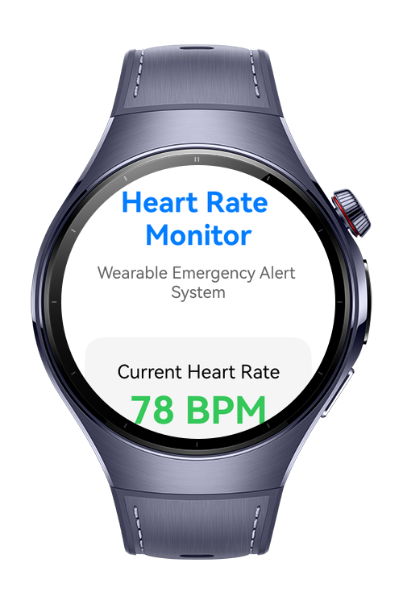
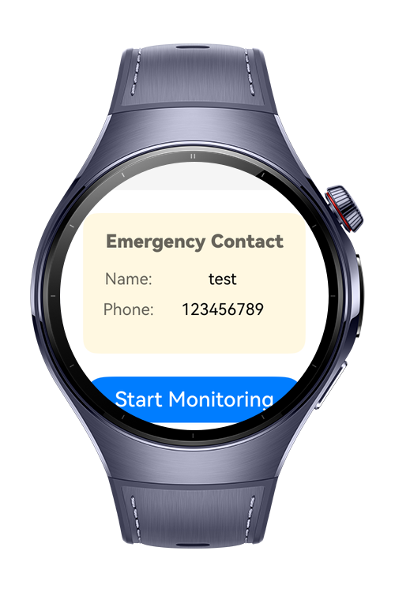
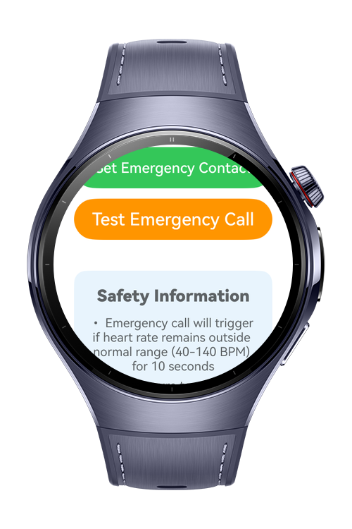
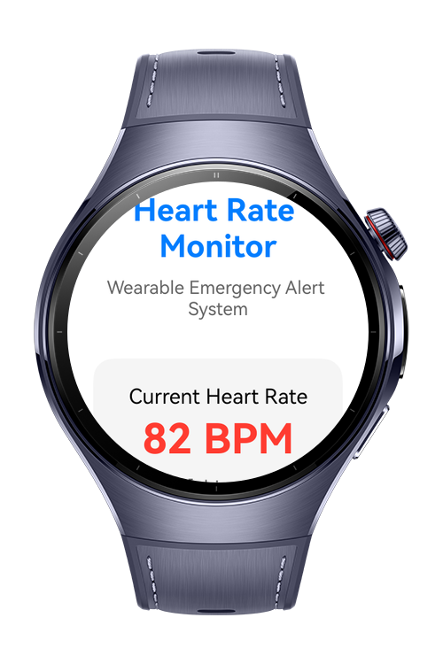

> **Note:** To access all shared projects, get information about environment setup, and view other guides, please visit [Explore-In-HMOS-Wearable Index](https://github.com/Explore-In-HMOS-Wearable/hmos-index).

# Lifeline
Lifeline is an emergency app that tracks users heart rate. 

# Preview

<div>    
  
  
  
  
</div> 

# Use Cases

User can set an emergency contact and let app measure heart rate. Emergency call will trigger if heart rate remains outside normal range (40-140 BPM) for 10 seconds

# Technology
## Stack
  - **Languages**: ArkTS, ARKUI
  - **Frameworks**: HarmonyOS SDK 5.1.0(18)
  - **Tools**: DevEco Studio Vers 5.1.0.842
  - **Libraries**: 
      - @kit.ArkUI 
      - @kit.BasicServicesKit
      - @kit.AbilityKit 
      - @kit.CallServiceKit
      - @kit.SensorServiceKit
## Required Permissions
  - `ohos.permission.READ_HEALTH_DATA`
  - `"ohos.permission.READ_CONTACTS`
  - `ohos.permission.VIBRATE`

# Directory Structure

````
├───AppScope
│   └───resources
│       └───base
│           ├───element
│           └───media
├───entry
│   └───src
│       ├───main
│       │   ├───ets
│       │   │   ├───model
│       │   │   │    └───TypeUtils
│       │   │   ├───pages 
│       │   │   │   ├───Index
│       │   │   ├───utils
│       │   │   │   └───ContactUtils
│       │   │   │   └───PermissionUtil
│       │   │   ├───types
│       │   │   │   └───Contact
│       │   │   │   └───MainMenuItem
│       │   └───resources
│       │       ├───base
│       │       │   ├───element
│       │       │   ├───media
│       │       │   └───profile
````

# Constraints and Restrictions
## Suported Devices

- Huawei Watch 5

# LICENSE

Lifeline is distributed under the terms of the MIT License.
See the [LICENSE](/LICENSE) for more information.

